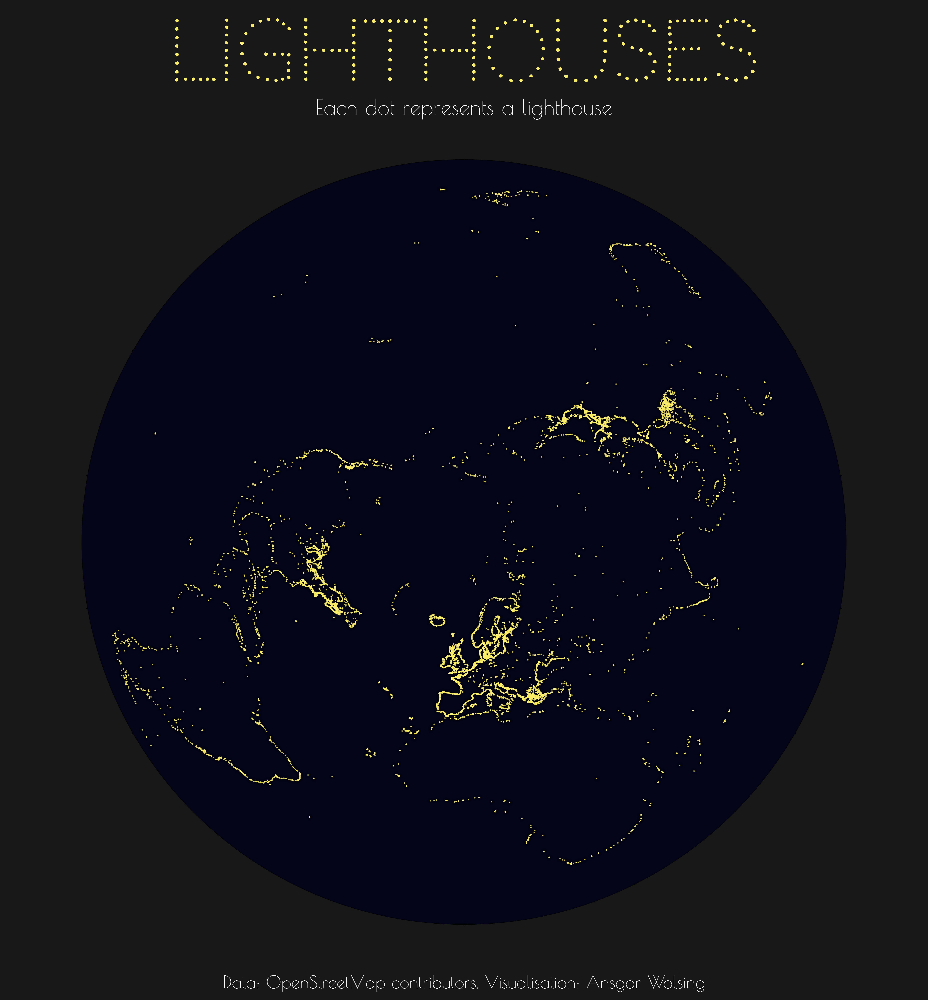
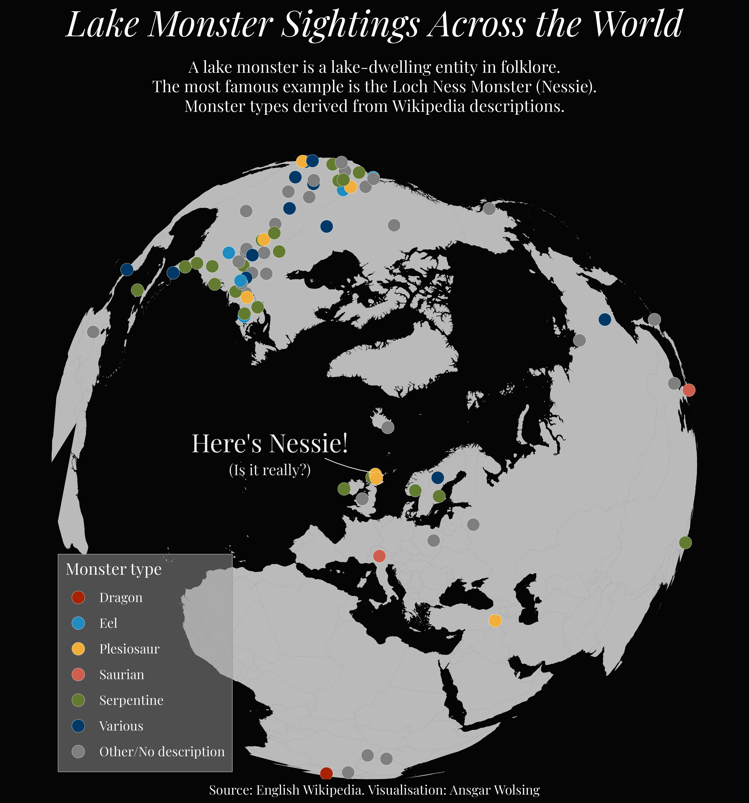

# 30DayMapChallenge 2022

My contributions to the #30DayMapChallenge in 2022

## 01 \| Points

**Where the Streets have German Chancellors' Names**\
Towns in 🇩🇪 where streets are named after Chancellors of the Federal Republic of Germany.

*(To be fixed: Location of Hamburg)*

## 02 \| Lines

**Rivers of Germany** \
River courses coloured by their length within Germany. (i.e. the Rhine has the longest course within Germany, while the Danube is the longest river flowing through Germany overall.)

## 03 \| Polygons

**What if everybody in Germany supported the nearest football club?**\
Voronoi polygons show the area where every point is closest to a particular stadium of Bundesliga + 2nd division.

## 04 \| Colour Friday: Green

**Football grass pitches in Germany**

**Countries with green colour in their flags
**

## 05 \| Ukraine

## 06 \| Network

## 07 \| Raster

## 08 \| Data: OpenStreetMap

## 10 \| Bad Map

## 11 \| Colour Friday: Red

## 12 \| Scale

## 13 \| 5-minute Map

## 14 \| Hexagons

## 15 \| Food/Drinks

16 \| Minimal

## 18 \| Colour Friday: Blue

## 19 \| Globe

## 20 \| My Favourite...

## 21 \| Data: Kontur Population Dataset

## 24 \| Fantasy

## 25 \| Colour Friday: 2 Colours

## 

## 27 \| Music

## 29 \| Out Of My Comfort Zone

First time using Observable to create a map of nationalities of Premier League players: <https://observablehq.com/d/22f5c68721b716a7>

